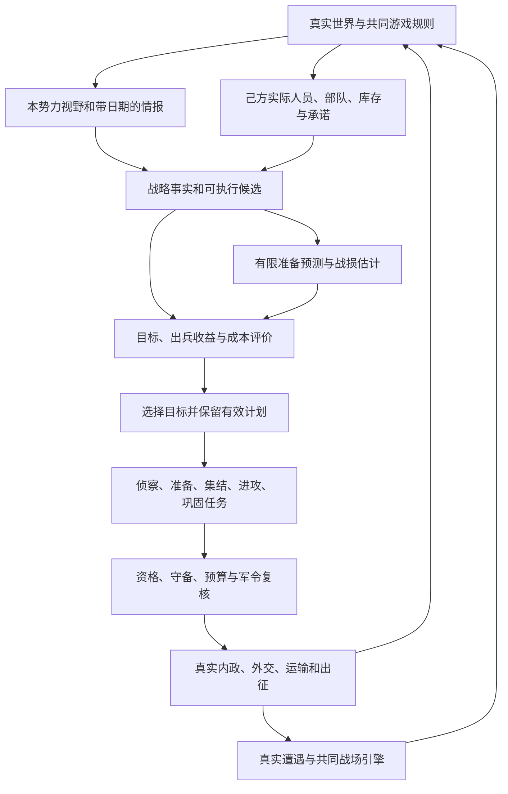

# 当前 AI 架构、输入输出与建模评价方法

核对日期：2026-10-09。本文记录当前程序实际运行的 AI，不把后续方案写成已实现能力。核对时战略存档版本53、势力 AI 结构7、战略目标结构3、战斗规则114；版本和参数以后续源文件为准。

本文中的“建模”指把真实状态转成兵力、预算、需求、任务、候选与可行性约束；“评价”指候选动作的内部评分。“验证 AI 水平”另指通过真实模拟测量执行、战果和代价，不能用内部评分高低代替。

## 1. AI 在游戏流程中的位置

普通全国模式由势力控制器统筹长期目标，城市与武将执行具体事务，军团执行真实军令，战场使用共同自动行动引擎。玩家势力仍可使用自动内政、选将推荐和委托战场；全 AI 观战通过同一控制器管理所有势力。



调用时机以 [strategic-campaign.mjs](../strategic-campaign.mjs) 为准：

- 新旬开始：`beginExecution` 先建立本旬经济结算状态，再运行整军与势力计划、外交委任、内政选事。新的军事承诺在新内政事务开办前形成。
- 每日开始：`prepareDay` 先处理外交生效、俘虏、实际供给和视野，再调用势力 AI，之后军团与运输人员实际移动。人员、侦察和视野随后继续核对。
- 势力 AI 每日最多运行一次；完整目标评审和交给目标算法的视野、情报、资源输入只在每旬初刷新一次。旬内推进已有计划、紧急守备、补给与运输，实际执行继续按当日合法观察检查安全，准备资源就绪不提前重选目标。整军投资每旬一次，外交负责人通常每10天重评。
- 接敌后：建立真实战场，AI 选择首发和部署；战中每个时间步执行补位、移动、普攻和自动战法，军略在当步行动结束后检查。

性能实现保留共同规则：完整战略输入按旬建立；仅需军团或单城的查询使用同一迷雾规则的局部投影。一次只读选事、武将推荐或同城候选评分可临时共用粮道与供给预算，道路搜索保持原有最短路与同值择序。查询作用域结束即丢弃，任职、装运、支付、出兵、行军和每日供给结算后的下一次查询重新读取实际状态，不把旧输入当作执行许可。真实粮源、库存、道路拦截、180补给距离、运力及围城营地终点规则均保持不变。

**模式边界：**有 `scenarioId` 的全国模式使用本文的势力规划。无全国剧本的旧小地图原型仍由 `enemyOrders` 按道路路径段数选择最近玩家城市进攻，没有完整势力目标、准备预测和多城协同。独立战役只使用战场层，不运行全国内政、侦察、运输或君主战略。

## 2. 环节、输入、输出与方法总览

| 环节 / 入口 | 主要输入 | 输出与作用对象 | 建模和评价方法 |
| --- | --- | --- | --- |
| 势力目标：`createPlan / chooseFactionStrategy` | 己方城市预算、合法敌情、邻接道路、君主特点、旧目标与计划 | 周边势力进攻/防守/和平意向；攻占、保境、和平、恢复或发展目标 | 有限候选生成＋Utility 评分＋切换门槛＋既有进攻承诺 |
| 出兵研判：`offensiveFacts / evaluateOffensive` | 实际编组、行程、攻城输出、目标报告、来源城守备与人员 | 战损、粮耗、补兵金、收益成本、接受或拒绝原因 | 启发式能力模型与成本收益评价；资格和资源有独立否决权 |
| 准备预测：`forecastStrategicPreparation` | 各来源城库存、收入费用、在办运营、已装载运输、逐城需求 | 两旬内是否可准备、预计日期与原因 | 有限逐日资源前推，不运行真实战斗 |
| 攻城任务：`progressPlan / updateCaptureTasks` | 保存计划、真实人员位置、军令、粮草、情报和战果 | 集结/出征军令、任务状态、取消或巩固结果 | 固定攻城任务模板＋阶段状态机；按实际效果推进 |
| 侦察：`planStrategicScouting` | 主攻目标、报告日期、真实道路、合法负责人 | 派遣、保持或召回侦察任务 | 情报缺口优先级＋路程排序＋人员和轮换硬约束 |
| 守备/增援/护路：`emergencyOrders / planStrategicSupport` | 可见来袭、战场兵力、粮路、在途援军、到达时限 | 真正出兵、补充支持任务或沿路回城 | 需求缺口模型＋到达可行性＋近源贪心选兵 |
| 经济/运输/调任：`manageStrategicEconomy / logistics / personnel` | 城市预算、计划需求、科技、人员、仓储和道路安全 | 合法整补、装备、运输、人才调任命令 | 预算底线、缺口排序、真实路程与任务推荐 |
| 内政委任/选事：`prepareEnemyDomestic / beginDomesticTurn` | 本城六方向需求、人员、设施、冷却、事务和额度 | 太守与方向任职；具体事务或付费提案 | 共用选人评分；事务规则评分＋高分池加权随机选择 |
| 人才招揽：`talentCandidates / talentEligibility` | 人才线索、接洽进度、求仕意愿、资格和并行名额 | 可接洽对象、持续项目与实际入仕结果 | 明确资格门槛＋进度/质量排序；求仕规则见第7节 |
| 外交：`diplomaticAIPlan / evaluateDiplomaticProposal` | 君主城可用库存、敌情、条约、真实人员和整组条款 | 委任、拟案、反报价、AI 本方批准/拒绝 | 需求与机会成本评分＋条款利益估值＋信用折价 |
| 首发/补位/布阵：`rankEnemyReserves / planEnemyArmy` | 已抵达部队、当前能力、合法敌军、地形和已有在场效果 | 首发/补位人选和合法格位 | 当前分工缺口评分＋逐队格位启发式 |
| 战中行动：`pickTarget / moveUnit / readyTactic` | 射程、ZOC、占位、目标状态、固定战法、战意和冷却 | 合法目标、路线、普攻或首个可用战法 | 固定资格与优先规则＋局部评分＋六角网格寻路 |
| 军略：`chooseEnemyCommand / chooseStratagemPoint` | 本方持有军略、真实来源、充能、冷却、次数和有效目标 | 首个满足固定条件的军略；范围落点 | 固定触发顺序；落点仅比较有效目标队数 |
| 宝物：`manageTreasuresAI` | 己方实际宝物、合法受领者、兵种与已有羁绊等级 | 授予/装备，异地交付仍走真实运输 | 适用资格过滤＋有现役者优先＋稳定 ID 排序 |

以上不是一个统一最优化器。势力战略的五项算法已可替换；内政、外交、选人、支持任务和战场控制仍是各自模块里的现有规则。

## 3. 战争迷雾、情报更新与算法输入

### 3.1 已接入的军事观察边界

[strategic-vision.mjs](../strategic-vision.mjs) 提供 `cityIntelligence`、`observedArmies` 和 `intelligenceWorld`。地形、城名和道路已探索；外方城市使用当前可见数据或最近带日期的报告。未观察的城市资源未知，军事估计使用规则中的保守守备/城门假设，不把未知视为已知空城。

视野外城市易主不会自动更新本方报告。外军只以可见观察进入军事判断，观察投影清空后续 `route`、最终 `target`、粮路和具体任务，只保留当前位置及可观察的当前路段。己方真实信息与对方报告分开读取。

[strategic-context.mjs](../strategic-context.mjs) 再把观察转成不带世界状态引用的值：

| 数据 | 关键字段 | 含义 |
| --- | --- | --- |
| `ownCities[]` | `gold/grain/manpower/troops/wounded`；`income/costs/reserve/shortages/daysSupply` | 己方实际库存、未来一旬预算、现役与伤兵 |
| 预测附加字段 | `operations/incoming/workLimit/workRemaining/oneTimeGold/grainCapacity` | 已在办运营的公开预期、真实在途货物、共享办理额度及单次费用 |
| `reports[]` | `id/owner/kind/known/visible/observedDay/power/gateHp/commerce/farm/grain` | 边境城市已知程度与报告日期；未知量可为 `null` |
| `enemies[]` | `id/faction/location/next/power/troops` | 已观察敌军及当前路段终点，不是秘密最终军令 |
| 评审辅助 | `neighbors/hostile/militarySignature/critical` | 已知边境势力、权威敌对关系、观察变化和己方供给告急 |

算法回调输入经结构化克隆和递归冻结，不含 `s`、随机种子、预先保存的成败抽签或外方秘密军令。注册模块仍是可信 JavaScript 程序；该接口隔离不是安全沙箱。

### 3.2 更新怎样影响决定

完整评审以旬为周期；`majorStrategicChange` 比较报告是否已知/可见、已知归属、敌军位置/当前路段，以及兵力或城门变化。兵力/城防较小值到较大值超过1.25倍可触发提前评审，供给告急状态改变和实际准备资源达标也触发复核。

攻击候选对旧情报再扣不确定性：未知报告扣20分；已知报告超过3天的部分每天扣2分、最多20分。有可行侦察任务时，未知或满3天的旧目标先等待更新；没有可用负责人时才使用保守估计。

侦察候选分数为：

```text
优先级 = 主攻目标200或普通边境80
       + 未知80，或 min(80, 情报年龄天数 × 20)
```

同分比较实际道路距离，再比较负责人智力，最后按 ID 稳定排序。最多两项，不重复目标；负责人留在城内、实际斥候每天105行程点。保留每城至少一名实际可办内政人员，优先空闲人手，仅必要时释放尚未开始的可选方向任职。

已在途斥候不为评分波动反复改派。普通目标需取得报告至少2天且新目标高至少40分才轮换；主攻目标可在已有报告后提前轮换，仍需满足优先级差和合法派遣条件。报告、随机点亮期限和实际路程保存，读档不重抽。来源见 [strategic-scouting-ai.mjs](../strategic-scouting-ai.mjs)、[侦察参数](../data/design/strategic-scouting-rules.mjs)与[战争迷雾专题](战争迷雾与武将侦察.md)。

### 3.3 观察接口尚未统一的环节

不能因势力军事接口已隔离，就宣称所有 AI 都经过同一情报快照。当前人才劝说候选仍从实际外方空闲人员、位置和忠诚筛选，`talentEligibility` 也使用实际任职与双方意愿；该分支尚未接入上述城市/军团情报投影。在野招揽另有 `talent.knowledge` 的位置确认条件。后续调整人才 AI 时应分别核对“可获知的线索”和“执行时真实资格”，避免把真实资格检验结果作为隐藏情报输入。

## 4. 势力战略怎样建模和评价

### 4.1 候选与君主特点

[strategic-ai.mjs](../strategic-ai.mjs) 的 `createPlan` 先枚举己方未围城城市及邻接可攻目标，按当前目标、已知空城、真实道路成本、商业等级、ID 排序，最多保留8组“集结城＋目标”。每组在满足最低兵力优势后最多评估3种增量编组。

来源城仅提供可实际出征、伤兵比例符合要求的部队，保留经济负责人和守备，通常只纳入10天内可抵达集结地的来源；优先空闲武将，再比较路程和共用出征推荐。更大编组可能解决反攻风险，也可能因补给和人员代价被拒绝。这是有限枚举与贪心编组，没有搜索所有编组、目标顺序或外交组合。

`factionStrategicProfile` 按君主性格区分谨慎、均衡、进取；统率与智力的加权值形成研判能力，政治影响内政机会成本权重：

```text
judgment = 0.5 × 统率 + 0.5 × 智力
errorBound = (1 - judgment / 100) × 0.6
developmentWeight = 0.75 + 政治 / 100
敌力估计 = 合法观测敌力 × (1 + 稳定有界误差)
```

误差由君主 ID 与目标 ID 的稳定哈希生成，不每日重抽、不消费战斗随机数。自己的库存、路线与驻地仍精确复核。

| 风格 | 攻守优势要求 | 出兵最低收益 | 周边守备参考比例 | 筹备/交战期限 |
| --- | --- | --- | --- | --- |
| 进取 | 1.20 | 10 | 0.50 | 30天 |
| 均衡 | 1.30 | 25 | 0.55 | 40天 |
| 谨慎 | 1.45 | 40 | 0.65 | 45天 |

上述是决策参数，不给任何一方增加资源或战斗属性。正式值见 [economy-rules.mjs 的 ai.offensive](../data/design/economy-rules.mjs)。

### 4.2 战力、行程与攻城时间

战略能力不是完整自走棋胜率。基础模型为：

```text
P = Σ[现役或实际战场HP × (0.7 + 统率/200 + 武力/500 + 智力/800)]
    × (0.7 + 士气/250) × (1 - min(0.4, 饥饿 × 0.1))
Q = 按兵力加权的 (0.85 + 当前兵种适性档 × 0.04 + min(3, 固定战法数) × 0.02)
fieldPower = P × Q
```

行程共用真实兵种、指挥、士气、道路和逐段行军算法。城防估计计入驻城实际部队、可见驻守军团和守备兵；有真实守军时才加城门耐久/6。无守军的已知空城不计城门战力，抵达按共同规则直接占领。

持续攻城输出只取前六队的基础攻城伤害，按攻击间隔与每日战斗步数折算，不假定所有爆发战法持续可用。已知有守军时：

```text
siegeDays = max(2, ceil(城门耐久 / 每日持续攻城输出))
空城 siegeDays = 0
duration = 最长集结天数 + 2 × 单程进攻天数 + siegeDays + 2
```

真实携粮不足则拒绝，不用虚假的工期上限掩盖缺粮；可见、来得及到达的目标援军进入守方估计。周边反攻按每个敌方势力分别累加可用战力，再取其中最大威胁，没有将独立敌对势力合成联军。

### 4.3 默认战损预测与出兵评价

`battlePredictor=attrition-v1` 的输出为估计值：

```text
estimatedLosses = ceil(men × min(0.8, defense / max(1, fieldPower) × 0.3))
consumedGrain = 每日军粮 × (2 × 单程进攻天数 + siegeDays + 2) + 集结耗粮
replacementGold = ceil(按来源城实际补兵单价加权的总兵数 × estimatedLosses / men)
militaryGold = ceil(men / 1000 × 规则维持金 × duration / 10)
counterPower = 周边最大敌方势力的估计可用战力 × 0.5
```

当前规则维持金为0，所以 `militaryGold` 当前为0；保留字段用于读取共同经济规则，不额外收取军费。

`offensiveEvaluator=cost-benefit-v1`：

```text
workCost = Σ(抽调人员主属性 × duration / 100 + 已投入事务金 / 50)
           × developmentWeight
benefit = 目标类型价值 + 商业等级 × 6 + (报告粮 > 6000 ? 15 : 0)
          + (可缓解己方边境 ? min(80, defense / 250) : 0)
cost = estimatedLosses / 80 + consumedGrain / 100
       + (replacementGold + militaryGold) / 50 + duration × 4 + workCost
offensiveScore = benefit - cost
```

这些分值只在出兵比较中使用，不是金币金额、市场报价或概率。经济资源估值与外交报价有各自用途，不能与此式混用。

**评分后仍有硬性准入：**攻守优势、实际携粮、每个来源城离兵后的守备、经济用人、逐城补兵金和预备兵、占后反攻承载均须通过。`evaluateOffensive` 返回 `accepted/reason` 与收益、成本、战损、粮耗等分解值，分数再高也不能绕过真实规则。

### 4.4 目标效用与持续性

攻击候选先减去君主风格的最低收益和情报年龄罚分，得到目标候选分；尚未就绪再扣12分。其它目标：

```text
攻占效用 = 攻击候选分 - (ready ? 0 : 12)
保境效用 = 100 + 已观察敌军战力 / max(1, 己方驻城现役总数) × 100
和平效用 = 保境效用 - 1
恢复 / 发展效用 = 0
```

这里分母是驻城现役人数，不是全势力野战能力；发展/恢复当前主要作为可执行的兜底目标，尚未精细计算未来开发收益。和平候选只在没有主攻承诺、已知敌军压力超过驻城现役总数65%且存在敌对邻国时生成，最受压的对方优先。保境候选来自真实围城或可观察来袭。

`selector=utility-v1` 选择已按效用降序和稳定键排序的第一项。新目标优势不足20分时保留同类、同目标、同集结城的可行旧目标；已有进攻计划继续作为承诺，紧急撤销由执行层按风险处理。战略“和平”只是外交倾向，实际敌对关系须等待条约生效。

## 5. 可替换算法的输入输出契约

[strategic-algorithms.mjs](../strategic-algorithms.mjs) 负责注册、调用、校验与保存配置；默认纯函数在 [strategic-algorithm-defaults.mjs](../strategic-algorithm-defaults.mjs) 和 [strategic-predictors.mjs](../strategic-predictors.mjs)。

| 类型 | 当前默认 ID | 输入对象 | 精确输出 |
| --- | --- | --- | --- |
| `battlePredictor` | `attrition-v1` | `{facts, profile, rules}` | `{estimatedLosses, consumedGrain, replacementGold, militaryGold, counterPower}` |
| `offensiveEvaluator` | `cost-benefit-v1` | `{facts, prediction, profile, rules}` | `{score, benefit, cost, workCost}` |
| `preparationPredictor` | `two-turn-v2` | `{context, requirements, horizonDays}` | `{feasible, readyDay, reason}` |
| `goalEvaluator` | `utility-v1` | `{candidate, context, profile, rules}` | `{score}` |
| `selector` | `utility-v1` | `{context, profile, candidates, previousGoal, rules}` | 候选中已存在的 `id` 字符串 |

`facts` 是 `offensiveFacts` 的输出，包含 `version/faction/day/target/intelligence`、攻守能力、兵数、耗粮、携粮、工期、补兵加权成本、反攻估计、逐城 `sources` 和被抽调人员 `work`。其中 `sources` 保存本城可用兵源/金、剩余守备、守备需求、集结天数和经济用人错误；`intelligence` 保存已知、可见和观察日。

当前分工为“规则适配器产生候选和事实 → 预测器估计后果 → 评价器打分 → 选择器返回 ID → 执行层复核”。选择器不能另造人员或军令；同一城市的不同具体编组有不同 `candidateId`，实际计划必须绑定被选中的编组。

接口只接受同步、可克隆结果，拒绝 Promise、额外字段和非有限数字。战损为0到真实人数的安全整数，费用为非负整数，粮耗/反攻为非负有限数；准备日期必须在当前日至预测窗口内，不可行时为 `null`。

`registerStrategicAlgorithm(kind,{id,run})` 注册带版本的新 ID；筹划期通过 `setStrategicAlgorithms(s,changes)` 替换一项或多项并触发复核。配置是全局 AI 配置，不是逐君主配置；君主差异由输入 `profile` 表示。评分尺度须与最低收益、准备罚分和切换门槛一致。当前没有注册回调的超时/搜索节点预算，新增复杂算法必须自行控制计算量。

默认候选生成、硬性准入、任务模板、计划承诺和真实命令执行尚未插件化。添加新的行动类型需扩展规则适配器和共同命令，不能只在选择器中返回一个新 ID。示例与替换验证见 [strategic-algorithms.test.mjs](../tests/strategic-algorithms.test.mjs)。

## 6. 有限准备推演与可执行计划

### 6.1 两旬准备预测

`two-turn-v2` 只复制各来源城资源并逐日前推最多20天。输入 `requirements[]` 为每城 `{cityId,gold,grain,manpower}`；来源城不存在或围城立即不可行。

前推顺序为：预计到达的已装载物资 → 库容限制 → 当日平均粮耗并检查是否断粮 → 当日已在办运营的公开预期 → 库容限制 → 旬末收入和预算费用 → 检查全部城市是否达到需求。

在办运营以基础数量乘公开成功机会估计，受当前剩余和下一旬共享办理额度限制，不读取预存成败、协作抽签或意外献赠。不预测未开办事务、未装载后续批次或未确定的中转下一程。运输只计路线当前安全、未受阻且实际装载的在途物资，按剩余道路成本和真实速度估到达。

单次工作、编组、待发金运输和债务预算不每旬重复扣除；周期费用继续计算。预测没有敌方反应树、战争全过程、完整状态克隆或实际战斗调用。内政失败与运输被截会使预期失效，后续每天读取实际结果调整；`feasible=true` 不表示资源可提前支用。

### 6.2 保存的数据和任务

| 数据 | 保存位置 | 主要字段与用途 |
| --- | --- | --- |
| 势力策略 | `campaign.ai.factions[f].strategy` | `neighbors/goal/revision/updatedDay/militarySignature/critical/trace` |
| 阶段目标 | `strategy.goal` | `candidateId/kind/targetFaction/targetCity/staging/status/score/createdDay/reason/planId/requirements/forecast` |
| 作战计划 | `campaign.ai.plans[]` | `id/faction/phase/target/staging/officerIds/origins/reserves/createdDay/updatedDay/deadline/reason/tasks/intelligence` |
| 城市需求 | `campaign.ai.cities[id]` | 前线、集结、后方、恢复等角色及实际钱粮兵源需求，影响内政与运输 |
| 支持任务 | `campaign.ai.supports[]` | 护路/增援种类、目标、战场、实际人员、期限及最近需求日 |
| 真实命令 | `campaign.domestic.orders[]` 与实际军团/行旅 | 完成事务后执行的编组、出征或运输，人员和资源不得重复承诺 |

[strategic-planner.mjs](../strategic-planner.mjs) 使用固定攻城分解：

| 任务 ID | 类型 | 依赖 | 完成凭据 |
| --- | --- | --- | --- |
| `observe` | 侦察 | 无 | 已满足当前情报/侦察等待条件 |
| `supply` | 准备补给与资金 | 无 | 实际粮草、逐城金与兵源满足；已出征阶段记录准备已通过 |
| `assemble` | 集结 | 无 | 所有人实际到集结城，或已真实出征 |
| `assault` | 进攻 | 前三项 | 目标确实归本势力 |
| `secure` | 巩固 | 进攻 | 不再围城、口粮、伤兵和守备满足完成条件 |

每项保存 `id/kind/dependsOn/status/updatedDay/refs`，状态为 `waiting/running/done/cancelled`；引用指向真实侦察、武将、军团或待执行军令。任务记录观察实际效果，不自行扣费、生成军团或发放战果。当前是一个固定 HTN 风格模板及执行状态机，尚无通用 HTN 搜索器或多种分解方法竞争。

计划按 `prepare → assemble → attack → consolidate → complete` 推进，也可 `cancelled`。最多一个主要进攻承诺；占城后转为当地巩固，释放主攻槽位与原人员的额外军事承诺，巩固仍单独检查真实守备。目标失守、人员缺失、集结城失守、道路失效、外交保护、敌军增援、供给告急或期限超出可导致等待、撤销和真实回撤。

### 6.3 命令怎样落地

`commandUnits` 经共用推荐确定军团长、军师，再调用 [strategic-orders.mjs](../strategic-orders.mjs) 的 `requestFactionOrder`。执行器校验驻地、人员资格、编制、队数、费用、携粮和实际道路；等待内政时只保存命令，最终生效才创建大地图军团。

`expeditionTiming` 先核实实际驻城与未外出，再判断事务：救援等候会错过真实到达时限时可立即执行；近一旬有中断、尚余不超过2天或高投入工程已完成大半时倾向等候；其余长事务可因出征优先中断。发兵前仍重新检查来源城守备、经济人手与整体出兵评价，不让历史计划授权抽空刚受到威胁的城市。

### 6.4 紧急守城、护路与战场增援

`emergencyOrders` 根据已观察来袭战力与实际城防求守城缺口，扣除来得及抵达的既有军团和等待军令；仍不足时释放主攻承诺，按实际到达天数从近来源派援。等待原事务的时间计入到达约束，军令不等于援军已经到场。

[strategic-support-ai.mjs](../strategic-support-ai.mjs) 另管理最多三项支持任务：

```text
战场增援缺口 = max(0, 对方已到达战力 × 1.15 - 己方已到达战力)
护路缺口 = max(0, 可见威胁战力 × 1.20 - 节点实际己方驻军战力)
```

战场模型计存活且已确认抵达的在场/后备人员；护路目标来自己方实际粮路、真实在途或待发运输通道。先处理增援优先级200，再护路100，同类比较缺口与稳定目标键。扣除能及时抵达的既有援军后，按来源到达天数贪心选兵，检查守备、经济用人、船、装备金、本城粮和往返携粮。到达窗口最多8天，战场剩余时间更短时取更短窗口；仍无法满足则不伪造援军。

任务结束、护路连续4天无需求、人员丢失或超过30天期限时解除等待命令并沿真实道路回城；需要更大兵力时补充同一任务，避免重复派队。断供预测还会结合实际返程时间提前收兵；战场兵损过重或缺粮也可撤退。支持判断为启发式，没有全局最优的军团调度搜索。

## 7. 城市经济、内政与人才 AI

### 7.1 预算、整军、物流与人才调任

[city-budget.mjs](../city-budget.mjs) 的 `cityBudget` 是共同只读模型：未来一旬收入减去真实驻兵/外军供给、预计未开办事务、外交行资、军令编制、待发运输和债务，再扣资源预留；另检查旬末收入到账前能否维持。已付事务不再计费，在途物资不作为现存可用库存。

战略预算采用 `workPolicy:'essential'`，保留基本赚钱、产粮、救治、征集兵源等需求，尚未开办的可选工程可让位；已批准提案与真实承诺继续计算。`manageStrategicEconomy` 只在预算允许时升兵、装备、预编和补兵。升级在同兵科内按已有武将特点选择，船与器械按实际路线和目标需要配备，不搜索所有兵种组合。

`logistics` 先处理预算短缺、口粮将尽的城市，减去已有实际运输及待执行安排以避免重复，再从保留来源预算后有余量的城市找安全道路。来源按实际道路成本排序，运输人按共同速度推荐，转漕、漕运往返和接粮会合仍逐批实际装卸，不提前入库。

当不被围城的城市口粮不足3天、撑不到旬末且无及时安全粮车时，先撤销可选进攻，再在保留守备前提下将部分现役完整转回本城预备兵。原规则的缺粮、减员和解散继续生效，不能凭空补钱粮。

`personnel` 为缺少内政人的大城从有余裕的己方城市调任真实空闲、无部队/伤兵人员。评价为“目的城最好岗位推荐 × 城市方向权重 − 原岗位推荐的一半 − 路径段数×5”；只选正值且可安全调任者，实际沿路移动。

### 7.2 共用选人评分

[officer-recommendation.mjs](../officer-recommendation.mjs) 的输入是 `(s, unit, taskProfile)`，输出 `{availabilityPriority,score,available,traits,reasons}`，同时用于玩家推荐与 AI。它只读、确定性，不抽签；分数只比较同类任务，不是成功率。

| 任务 | 模型 |
| --- | --- |
| 内政方向 | 读取该人的合法事务，使用与自动选事相同的高分池和权重，按事务需求、成功机会、数量/节费特性和工期折算，再参考实际协作 |
| 太守 | 政治＋真实太守收入、折扣与安抚特性 |
| 调任/运输 | 共同规则实际每日行进速度 |
| 军团任职 | 军团长统率、军师智力，再计合法任职机制；军略资格按名单 |
| 补兵 | 实际可补缺额，伤兵不作为直接补兵空位 |
| 预编/出征 | 统率×0.4＋武智较高值×0.25＋兵种适性档×8＋min(15,现役/300)＋固定战法数×2，并计已有羁绊点数 |

任务排序先看可用性及出征空闲优先级，再看分数和 ID；正在办事或外出者不会因评分高就跳过资格。出征推荐包含个人已获得羁绊点数，但不枚举人员组合凑档，也不预测替补入场后的羁绊。

`prepareEnemyDomestic` 补任空缺太守；产出不足时优先保障农业、商业，再按“人员×方向”推荐与城市意向权重贪心填补空缺，保留在办事务。额外经济人员仍消耗真实费用并共享本城办理额度。

### 7.3 具体事务、研究与人才对象

[domestic.mjs](../domestic.mjs) 的 `actionCandidates(s,assignment)` 输出 `{key,cost,amount,recruitMode,targetId,score,chance}`。先按方向、冷却、费用、设施、唯一施工/研究槽、目标资格、容量与共享额度排除不合法动作，再评分。

代表性优先级：粮食紧缺的督耕120分，正常不足储备75分；修缮100分并可加威胁20分；治伤65分再按伤兵增加最多20分。工程、征兵、商业、人才等各有独立规则，随后叠加执行人性格、数量/成功/节费特性和协作价值；同动作失败次数每次扣12分。势力准备、恢复或守备目标将相应合法事务乘1.3优先权重。

旬开始的实际选择并非总取最高分：

```text
good = 所有 score >= 最高分 - 14 的合法候选
weight(action) = score(action) - 最高分 + 15
按 weight 使用保存的内政随机序列抽取一项
```

输出进入真实 `action`；玩家付费事务可能先形成 `proposal`，须按原案裁示再开办。成本、工期、成功/部分成果/失败、施工地点与额度均由共同执行器处理。已有工作不因每日评分重新选择。

研究优先续办已保存项目；新科技按本城合法科技树筛选。模型计入科技层级、金粮兵缺口、当前兵科适配、军事节费和可见边境威胁。不是跨城市科技树或长期科技序列搜索。

`talentCandidates` 在资格通过后评分：招揽基础70、劝说45，已积累进度最多加15、质量最多加15，较高入仕意愿的招揽再加5；已投入项目优先，占用真实并行名额。求仕意愿由 [talent-core.mjs](../talent-core.mjs) 的共同模型确定：

```text
W = clamp(50 + 0.4×(相性适合度-50) + 0.4×(君主关系-50)
          + 同僚好友参考 + 岗位供需影响 - 旧主顾虑, 0, 100)
```

`W` 是入仕意愿、不是一次事务成功率。冷却、实际接洽范围、身份、稳定忠诚、旧主整理期和并行项目须独立通过；项目完工仍按真实签约资格结算。人才劝说的观察边界限制见第3.3节。

在野人物移动属于共同人物行为模拟：在有限可通行范围内比较目的势力意愿、同城好友、路径段数与保存随机扰动，随后逐日实际移动。这不是君主可读取的隐藏未来计划。

## 8. 外交决策与评价

[diplomacy.mjs](../diplomacy.mjs) 分三个环节：

1. `diplomaticCandidates` 根据方向、资源缺口、俘虏、已知压力、条约期限与重点势力拟定整组条款；先核验可申请的对象、路线和拟用部队。未知对方库存不是可确认承诺，接洽与签署仍须实际复核。
2. `diplomaticAIPlan` 比较合法负责人，输出 `officerId/direction/goal/target/score/reason/waitingDays`，达到门槛才委任；最多两名，已有项目不中途每日换目标。
3. `evaluateDiplomaticProposal` 在交涉完成后由各方分别评整组方案，输出 `score/benefit/cost/reason/style/judgment/approve`；AI 只批准本方，玩家批准不能由 AI 补写。

负责人分数：

```text
candidateScore = 真实需求优先级 + 战略和平偏好 - 单程出使路程天数×0.8
assignmentScore = candidateScore + 方向主属性×0.05
                  - 内政机会成本×developmentWeight - 接洽费×0.03 - 等待事务天数
```

方向主属性为交好魅力、通商政治、交涉智力。人员需真实在城且无外交冲突，另保留经济生产人员和来源城预算。

整组利益模型按入项计收益、出项计成本：金按稀缺性加权，粮按本城缺口调整价格，预备兵按缺口估值；城池计经济、城防与君主城价值，俘虏计真实赎回价值。和平计军事压力与君主倾向，并在对方军力信息足够时扣除停止优势扩张的机会成本；援军计兵力、路程、共同敌人与真实服务成本。

```text
proposalScore = round(benefit × (1 + 稳定有界研判误差)
                       × clamp(对方信用/100, 0.4, 1) - cost)
```

非负评分才倾向批准，实际资源和条款资格另行验证。未来付款有时间折价；不合适金钱对价最多两轮反报价，新版本清除旧批准。签署、金粮预留、运输、条约生效和军事履约均是实际流程。没有多方外交博弈搜索，也没有因“评价成交”直接生成物资或虚构援军。参数见 [diplomacy-rules.mjs](../data/design/diplomacy-rules.mjs)与[外交专题](外交系统设计.md)。

## 9. 战场 AI 与共同自动行动

### 9.1 首发和后备补位

[battle-ai.mjs](../battle-ai.mjs) 的 `rankEnemyReserves(b,candidates,side)` 仅比较已抵达、已确认、存活的后备；`fillSlots` 只在合法空位出现时调用。通常六队上场，合法额外名额遵循共同规则。输出是后备的择序，不重排既有在场行动数组。

模型将实际输出、承伤与支援能力在当前己方候选池归一化：

```text
output = max(普攻威力×3/攻击间隔, 已有进攻战法类型对应的武技或谋略威力×0.9)
bulk = 当前HP × (1 + 防御/100)
基础分 = 55×归一化输出 + 20×归一化承伤 + 5×min(1,智力/100)
```

再按当前前排缺口、已有前排、支援缺口、友军伤势、可见敌军骑/前/后排兵力占比、地形及攻城需要加分，稳定同分按 ID。首发和补位不假设尚未入场的场地羁绊，不搜索替补进场顺序的未来组合。

### 9.2 初始布阵

`planEnemyArmy` 仅在第0步、部署未锁定时摆放已选首发。前排、后排、骑兵侧翼及舰船各有偏好位置；骑兵按可见敌军分布避开枪戟密集侧，支援跟随真实核心，远程偏好高地、伏兵利用树林，参考当前已生效阵区。

合法格位的基础代价为 `4×横向偏差 + 2×纵向偏差`，再加支援距离、骑兵地形阻碍、沼泽代价等，取最低代价格位并占用。是逐队贪心部署，未搜索全局站位，也不挑选羁绊人员组合。固定战法不因对手重抽或另选，配置复核只恢复共同固定配置。

### 9.3 选敌、移动与普通行动

[engine.mjs](../engine.mjs) 的 `pickTarget`、`findMoveRoute`、`moveUnit` 与 [engagement.mjs](../engagement.mjs) 同时用于双方。玩家的部队也按共同规则自动走位和攻击。

目标选择先处理可见/可攻击、嘲讽、有效集火、近战接触、特性追击与最低射程等资格；近处残血收割和合法远程目标等优先池随后决定可比较对象。普通比较取最低代价：

```text
目标代价 = 距离×距离权重 + 目标HP比例×血量权重
           + 真实绕路代价 + 建筑威胁/器械/连续攻击修正
           + 克制、集火、骑兵后排偏好、守备和攻城意图修正
```

权重在共同 [combat-rules.mjs](../combat-rules.mjs)，不是势力 Utility 分数。箭塔按当前射击威胁、军乐台按战意缺口、救护营按真实伤兵评价；无当前军事作用的建筑不作为首选，只在实际阻断通往合法军事目标的必要路径时清障。硬性优先级不会被小幅连续攻击偏好覆盖。

寻路在六角格上使用广度优先搜索，目标是合法攻击格、支援格或撤离边界，处理真实占位、地形、守备边界、最小射程与 ZOC。失去路线后重新选可达目标；行动仍受真实移动速度、脱战准备、形态展开和冷却限制，不提供 AI 专属穿越或攻击。

### 9.4 自动战法

[tactics.mjs](../tactics.mjs) 的 `readyTactic` 每个行动步按已固定的战法顺序检查战意、冷却、次数、调息、异常与合法目标，返回首个可用的 `{skill,target}`。前一战法暂无资格不会阻止后面合法战法；不比较不同战法收益，不新增顺序优化变量。

`tacticTarget` 按具体效果判断：治疗选真实伤兵，控制避免已保护/已覆盖目标，穿甲参考防御，范围攻击比较实际覆盖，冲锋使用合法路径，十胜奇谋参考剩余施法威胁及局部覆盖等。自动目标可以有局部评分，但仍是双方共同固定处理器，没有调用君主战略搜索或独立战术强化学习。

### 9.5 军略触发与范围落点

`chooseEnemyCommand` 先要求战场未结束、非撤退、有合法己方与敌方对象；可用列表及实际施放再检查持有者、来源、充能、冷却和每场限次。按以下效果的固定顺序找首个满足条件者，同效果保留已有列表顺序：

```text
cleanse → heal → forceReserve → tacticRefresh → invincible → magicImmunity
→ stun → eightFormation → firestorm → ambush → rapidAdvance → shield
→ blockade → catastrophe
```

例如治疗检查真实可救伤兵，奇兵检查已抵达后备，整备检查次数缺口，雷火检查至少两队可见敌军。解控和范围效果还通过落点/实际效果资格判断，不能只看触发函数中的简化布尔值。

[stratagem-area.mjs](../stratagem-area.mjs) 的 `chooseStratagemPoint` 枚举合法格中心和矩形0/90度方向，选覆盖最多有效目标队数的落点；不按总兵力、伤害收益、未来接敌或组合规划评分。`issueCommand` 最终共同校验和扣资源。军略固定触发不会因换势力战略算法而改变。

## 10. 宝物分配

[treasures.mjs](../treasures.mjs) 的 `manageTreasuresAI` 在初始化和日常人员核对后运行。输入只包括可合法分配的己方实际宝物与人物；已有持有人已装备的宝物通常保留，不每日优化换手。

羁绊宝物筛选当前确有加点效果者，射程宝物筛选适用弓兵；其余按共同受领资格过滤，再优先有现役部队者和稳定 ID。输出走 `grantTreasure`，异地人员仍需真实交付。没有宝物组合收益搜索，也不预知隐藏宝物发现结果。

## 11. 决策记录、存档与自动验证

### 11.1 当前已经保存什么

策略 `trace` 最多12次评审，每次记录日期、复核原因、所选目标、五项算法 ID、最多8项候选的 ID/类别/目标/评分/就绪/原因/准备预测。作战计划、任务日期与执行引用、支持任务、城市需求、等待命令、侦察报告及随机状态随当前存档保存。

`campaign.ai.decisions` 保留最近80条军事/运输等决定；人物每日记录和事实节点保留实际办事、行军、战斗及结果。当前 trace 不是完整树搜索日志，也不保存每一项被准入条件淘汰的候选；完整出兵评分分解可从评估返回值获得。后续若需逐候选特征回放，应扩展记录而不是假定已有。

存档保存算法 ID、不保存函数。读取自定义算法存档须预先注册同 ID 实现，未知实现拒绝载入；只维护当前存档，不做旧结构迁移。

### 11.2 机制与契约回归

| 验证入口 | 能证明什么 |
| --- | --- |
| `npm run test:strategic-planning` | 目标、具体编组、准备预算、计划持续性、真实军令/运输、支持任务与全 AI 推进 |
| `npm run test:strategic-algorithms` | 算法替换、只读输入、输出契约、非法候选、版本保存和确定性 |
| `npm run test:war-fog` | 侦察资格/路线、报告更新、军事投影和迷雾相关回归 |
| `npm run test:strategic-support` | 真实护路、增援、到达时限、来源预算和支持人员承诺 |
| `npm run test:ai-city-budget` | 预算、供给与征补/出兵关联 |
| `npm run test:recommendations`、`npm run test:domestic-proposals`、`npm run test:talent` | 共用选人、内政合法选择/原案执行、人才规则 |
| `npm run test:diplomacy` | 报价、批准版本、真实出使、签署、交付与外交 AI |
| `npm run test:stratagem-ai`、`npm run test:battle-buildings` | 固定军略自然触发和范围资格、建筑选敌与共同行动 |
| `node --test tests/battle-ai.test.mjs tests/deployment-order.test.mjs tests/ai-bond-boundary.test.mjs` | 部署/补位与战场羁绊优化边界 |

这些测试验证行为与规则约束，不能单独证明扩张水平、年度经济承载或胜率。修改算法时先通过相关机制测试，再比较实际表现。

### 11.3 全 AI 自然模拟：已有工具和输出

[scripts/audit-strategic-planning.mjs](../scripts/audit-strategic-planning.mjs) 创建原始全国剧本、开启 `allAI:true`，保留普通迷雾、正常内政意外和真实战斗，通过 `advanceCampaignDay` 推进。没有给 AI 加资源、预设战争、改道路或强制胜负。

```sh
npm run audit:strategic-planning -- --scenario=guandu-200 --seeds=417,643 --days=30 --out=work/ai-documentation-audit
```

当前保存：每势力每天城数、金粮兵源/现役、缺金/缺粮城市、城市与军团缺粮累计；真实离城日期/队数/逐队兵数；计划阶段、目标与候选评审事件；算法配置、源码哈希、完整末尾存档、失败存档和耗时。每旬与终点校验存档往返，加载或模拟期间源码变化会报错。

替换算法的对照仍用同一剧本、种子和时长：

```sh
npm run audit:strategic-planning -- --scenario=guandu-200 --seeds=417,643 --days=30 --selector=development-example-v1 --algorithm-module=tests/fixtures/strategic-development-algorithm.mjs --out=work/ai-documentation-comparison
```

还可使用 `--goal-evaluator`、`--offensive-evaluator`、`--battle-predictor`、`--preparation-predictor` 分别替换；外部模块导出 `strategicAlgorithms=[{kind,id,run}]`。对照应固定源码快照及依赖，避免同期经济或战斗改动混入算法效果。

### 11.4 怎样评价实际战略水平

以下是利用已有原始记录的评价口径；部分指标需离线汇总或增加采样，当前脚本没有全部自动计算：

| 维度 | 建议比较的实际指标 | 必须保留的限制 |
| --- | --- | --- |
| 合法与执行 | 非法/重复军令、资源重复承诺、可行计划完成/取消原因、集结与运输实际完成 | 硬约束失败局不能删除 |
| 机会识别 | 可观察机会到建目标/出征的间隔、实际占城及保持、空城与有守军目标分开 | 对照只使用当时本方可获情报 |
| 持续性 | 目标切换次数、无进展等待天数、重复中断内政、巩固实际完成 | 单纯减少战争不是变强 |
| 成本与风险 | 战损、救回伤兵、补兵支出、粮耗、实际断粮/运输损失、后方失城 | 当前日志不足项须补实际事件，不用评分代替真实代价 |
| 经济承载 | 逐城长期金粮兵源、旬末前缺口、生产人员、真实出征规模分布 | 开局库存暂时够用或只派小部队不能证明可持续 |
| 研判质量 | 出兵时预测与真实同一场战果的偏差；预测准备日与实际就绪日偏差 | 当前战损模型尚未经独立战斗样本校准 |
| 算法成本 | 每次评审时间、每日模拟时间、存档体积 | 当前脚本主要记录整场运行耗时，细粒度需额外计时 |

开发种子用于调参，独立验证种子用于比较；覆盖不同剧本、单城/多城、贫富城市和强弱邻国。先做短期执行检查，再扩展长周期自然战争模拟。报告每个种子的原始结果和实际出征规模，不只汇总胜率或总领土。

战场 AI 对 AI 对照必须双方都使用现有 AI 首发、补位和军略；`stepBattle` 的 `aiSides:[0,1]` 只是控制器设置，初始部署也须调用双方 AI。固定阵容、合法兵力和援军、交换左右、独立种子、确定性续战都要保持。模拟玩家优化布阵的实验应单列，不能当作双方同 AI 验证。

已有 `audit:scenario-economy`、`audit:scenario-warfare` 可诊断经济和实际战争用度，但它们使用自动批准、关闭内政意外的诊断封装，后者另包含明确的测试玩家下令，不能冒充全 AI 自然战略对照；`audit:strategy` 也不是上述全 AI 审计的替代。

## 12. 当前能力边界与后续改进位置

已经具备：势力统一目标、稳定计划、固定攻城分解、有限资源预测、独立城市预算、真实侦察/支持/物流、执行反馈以及五项可组合的战略算法接口。

尚未具备：经独立实战样本校准的胜率/战损模型、完整多回合战争搜索、敌方反应树、多种通用 HTN 分解器、所有 AI 环节统一观察契约、逐势力独立算法配置、通用算法运行预算和完整候选特征日志。

改进默认评分可替换评价器；改进战损或准备估计可替换对应预测器；选择不同已合法候选可替换选择器。新增战略行动、统一人才情报边界或改进内政/外交模型需调整对应适配和共同执行流程。战场军略仍遵循已确认的固定触发边界，不通过势力算法接口扩大权限。

规则和数值入口： [势力战略专题](势力AI与跨旬作战计划.md)、[正式规划参数](../data/design/strategic-planning-rules.mjs)、[经济规则](../data/design/economy-rules.mjs)、[支持参数](../data/design/strategic-support-rules.mjs)、[选人专题](任务推荐与AI选人.md)、[固定战场 AI 边界](固定阵容AI决策边界-规则40.md)、[军略触发专题](军略AI固定条件触发.md)。`data/design/ai-parameters.mjs` 仍是标记待接入的底稿，不能把其中预期能力当作运行实现。
