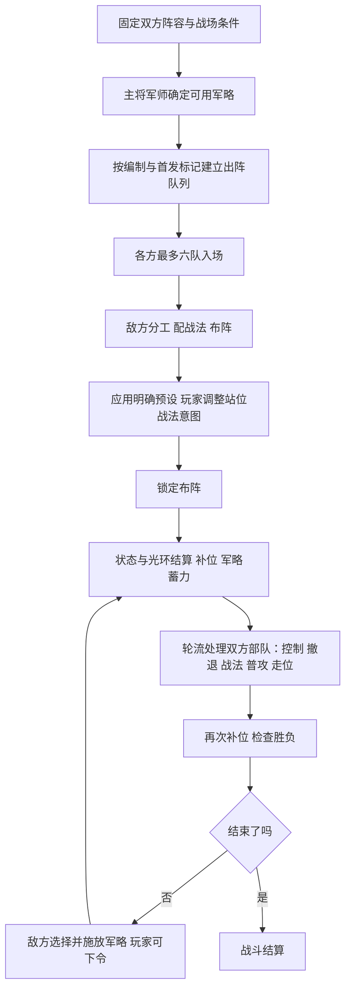

# 固定阵容下的战斗 AI 决策全流程（规则 39）

> 历史版本：当前已采用规则40的随机学习，取消 AI 职责模板选装与自由三槽配置。后续 AI 仅优化出阵顺序、初始站位和军略施放，详见[当前决策边界与实现状态](固定阵容AI决策边界-规则40.md)及[战法学习规则](战法随机学习-规则40.md)。下文保留规则39当时的实现与验证记录，不应将配装段落视为现行规则。

核对日期：2026-09-19。本文记录当前工作区的实际实现，供解释行为、复现对局和后续改进使用；不是拟议设计。范围是双方武将、兵种和兵力已确定后的一场战斗，不包含战略地图上的征兵、选将、行军和外交。

## 1. 先回答：歼灭、固守、攻城到底影响什么？

这三项叫**战前意图**，对应 `annihilate / hold / siege`。它们直接改变普通目标选择函数 `pickTarget` 的评分，进而影响普攻对象、接敌方向和走位。它们没有分别对应三套完整 AI，也没有直接参与战法配装、战法选目标或军略评分。

| 意图 | 当前直接作用 | 实际含义与边界 |
| --- | --- | --- |
| 歼灭 | 城门目标评分加 24，其他目标没有意图专属修正 | 相对降低打城门的倾向；仍按距离、剩余兵力比例、克制和接战约束选敌，不是全队自动集火同一人 |
| 固守 | 在歼灭相同的城门惩罚之外，对所有候选目标额外加 `2 × abs(目标 x − 己方基准列)`；我方基准列为 2，敌方为 11 | 越接近本方基准列的敌军越优先。它是目标偏好，**野战中不等于原地站桩，也没有因选择固守而新增活动边界** |
| 攻城 | 城门评分从加 24 改为减 24 | 城门相对优先级提高 48 分，但仍须服从挑衅、接战、可达性和射程等约束；不会让所有战法都攻击城门 |

以上评分越低越优先。比如只比较距离与意图，切换攻城对城门带来的 48 分变化，大于 5 格距离造成的 45 分变化；但只有当城门进入同一个合法候选池时，这种比较才成立。固守使用的是目标的横向位置，不是距本队的距离，也不是距城门的完整六角距离。

**真正的攻城守方身份还有独立规则：**目标离己方城门每远 1 格，评分加 4；常规寻路及冲锋路径限制在己方防线内，我方为 `x <= 4`，敌方为 `x >= 9`。这是攻守身份的规则，守方改选歼灭也不会解除。不要把它误认为固守意图的效果；混乱随机移动等分支另有处理，不能据此理解成所有位移都受同一边界限制。

默认意图：攻城方为攻城，守城方为固守；野战中军团姿态为防守时默认固守，否则默认歼灭。只有真正的攻城方可以选择攻城。确认开战会锁定双方意图，开战后暂停、读档也不能修改。意图不改写胜负条件：选固守不会凭空获得“坚持若干步就赢”的目标。

另有一个容易混淆的字段 `side.tactic`：稳健、激进、防守是军团姿态，参与面板计算。激进攻击 ×1.18、防御 ×0.91；防守攻击 ×0.92、防御 ×1.15；稳健无上述修正。**选择固守意图不会自动切换成防守姿态或增加防御。**自由对战的双方默认使用稳健姿态。

## 2. 谁负责哪些决策？

| 环节 | 我方：普通手动战斗 | 敌方：战斗 AI | 战略模式自动托管补充 |
| --- | --- | --- | --- |
| 军略来源 | 已任命的主将、军师决定；自由对战有自动军师初始化 | 同一来源规则 | 沿用军团任命；来援军团会追加指挥人员 |
| 三槽战法 | 初始模板、关卡预设或玩家配置 | 战前规则配装；明确关卡预设优先 | 不会把我方全面重配成敌方模板 |
| 首发与预备队 | 编制、首发标记、队列和到达时刻 | 同样规则，没有临场选人算法 | 新来援部队追加预备序列 |
| 战前站位 | 默认落位，可在布阵阶段手动调整 | `planEnemyArmy` 自动布阵 | 初始化仍调用原有敌方规划器 |
| 战中走位、普攻、战法 | 部队自动执行 | 与我方共用同一套部队行动代码 | 完全相同 |
| 军略施放 | 玩家在蓄满后选择时机与军略 | 每步结束时按分数自动选择 | 还会替我方调用同一个军略评分器，时点见第 8 节 |
| 全军撤退 | 玩家下达免费军令 | 军略评分器不会主动选撤退 | 不能把该评分器理解成自动判断败局后撤退 |

所以，战中部队行动是双方共同的自动规则；主要的不对称在战前配置和军略控制权。`planEnemyArmy` 的名字确实对应只规划 `side=1`，并不是两边都运行的全局阵容优化器。

固定武将名单也不等于固定结果。要复现对局，还要固定等级、属性、兵力分配、任命、三槽顺序、首发与预备队顺序、到达时刻、地形、站位、姿态、意图、随机种子和玩家军略操作时点。规划器与军略评分本身不用随机数；混乱移动、概率判定等战斗过程会使用战斗随机种子。



该图概括普通战斗；战略托管我方军略会在下一次 `stepBattle` 调用前检查。

### 2.1 双方战法与战斗规则的一致性

当前核对未发现敌方专用战法池、免战意、免冷却或按 AI 身份提高伤害/控制概率的战斗分支。公平性口径是：**相同武将、兵种及其他条件，玩家与 AI 使用同一套可用战法和施放规则**；不同武将的专属并不要求彼此通用。

- 可用战法统一由 `availableTactics` 返回：本兵种六种基础战法，加本武将有资格使用的专属；不根据敌我身份增加战法。
- 玩家配置与敌方自动规划都经过 `validLoadout / configureTactics`：必须三个不同战法，且全部属于该部队可用池。AI 没有第四槽，也不能借用其他武将专属。
- 双方共用 `readyTactic`、`finishTactic`、伤害、效果概率与属性计算，战意、冷却、射程、控制与合法目标限制一致。
- 军略也共用目录来源、12,000 蓄力门槛、充能公式及施放校验；敌方自动选择并不免除这些条件。
- 关卡可以明确设置不同兵力、等级、援军、守方护盾和胜负条件。这是初始场景条件的不对称，不能说所有关卡都拥有相同资源；同样也不能把这些条件误报成 AI 使用了玩家无法装备的战法。

2026-09-19 补充核对：按目录默认参数创建 21 个场景，对其中 153 个敌方部队的三槽逐个校验，并将同一部队副本置为我方后调用同一配置接口，全部合法；`loadouts`、`battle-ai`、`engine-command-phase`、`custom-battle` 四组共 24 项现有测试通过。该结果针对当前战斗实现与本次检查范围，不代表对战略层所有资源规则的审计。

## 3. 选军略：先确定“有哪些”，再决定“放哪个”

### 3.1 可用军略池

每名武将可提供的军略由 `OFFICER_STRATAGEMS` 指定。一个军团只取主将与军师的军略并集，去除重复；副将身份本身不提供军略。多个军团参与同一方时，再合并这些军团的来源。

这里没有“战前从全部军略中自由选若干个槽位”的算法。主将、军师任命一旦确定，可用目录就确定。例如曹操提供全军猛攻、鼓舞三军、坚壁之策，郭嘉提供攻心夺气、断敌援路、火攻连营。

自由对战初始化时，主将取名单第一人，副将取第二人，军师由 `chooseArmyAdvisor` 在有兵的武将中排序选择：

1. 能提供多少种主将尚未提供的军略，更多的优先。
2. 相同时，智力高者优先。
3. 再相同，按武将 ID 排序。

该函数没有排除主将本人，因此军师可能与主将是同一人。这是自动初始化规则；明确关卡任命与玩家管理的军团任命不会每步被重选。它也没有针对歼灭、固守、攻城或对面阵容计算军略组合收益。

战斗保存指挥人员信息，不会因为某位主将或军师暂在预备队、被控或溃败就自动删除其军略目录。战略模式有新军团参战时，会追加其指挥人员；在本文“双方阵容固定”的前提下，不涉及这种变化。

### 3.2 军略蓄力与消耗

- 两边独立蓄力，上限均为 **12,000**。
- 每步在补位后增加本方在场存活部队的**原始智力总和**。不是只有军师供给，也不是按兵力人数、剩余兵力比例或谋略威力加权。
- 预备队不供给；全军撤退后停止供给。仍在场的眩晕、混乱或封技部队没有被该求和函数排除。
- 每次合法军略清空蓄力，不能存多次使用量。同一种军略冷却 8 步；没有额外全局军略冷却。
- 施放必须已开战、未结束、未撤退、来源合法、该军略冷却结束且蓄满。救疗还要求实际伤兵，火攻要求双方均有在场部队，断援与后军固阵分别要求对方、本方仍有活预备队。

军略的具体评分和施放时序在第 8 节。这里要区分：**目录来自任命，充能来自所有在场部队，选择来自当前局面评分。**

## 4. 选战法：战前分工与三槽配置

### 4.1 敌方分工

`planEnemyArmy` 仅在 `tick=0` 且布阵未锁定时执行，读取公开阵容、当前兵力、属性、地形与站位。它不试打、不搜索胜率，也不偷看未来随机数。

先找三个候选角色，均优先已经在场者，再按下列指标和 ID 排序：

| 候选 | 候选范围 | 同为在场或同为预备队时的排序指标 |
| --- | --- | --- |
| 主核 | 除辅兵外的存活部队 | `max(当前攻击, 武力威力, 谋略威力)` 越大越优先 |
| 主坦 | 存活枪兵、戟兵 | `当前兵力 × 当前防御` 越大越优先 |
| 支援者 | 存活辅兵、弩兵、骑兵；排除武力不低于智力的骑兵主核 | 辅兵优先；辅兵按 `政治×1.4 + 智力×0.6`，其余按智力 |

然后逐队按先后条件分配模板：

1. 是选中的支援者，且本方总队列长度至少 3：护卫模板。
2. 是主坦，且本方队列中有弓、弩或兵器：护卫模板。
3. 智力大于武力加 10：控制模板。
4. 其余：强攻模板。

这些是角色启发式，不是按“固守全员护卫、歼灭全员强攻”划分。角色选择考虑预备队，且在场者优先；部队上场后不会因主核阵亡而动态重新配装。

### 4.2 基础模板与顺序

箭头就是槽位 1 → 2 → 3，也就是战中检查的优先顺序。表中“强攻、护卫、控制”统一指内部角色 `assault / guard / control`；界面会按兵种显示更具体的角色名，例如枪兵的“物理战坦、纯坦克、法术战坦”。

| 兵种 | 强攻 | 护卫 | 控制 |
| --- | --- | --- | --- |
| 枪兵 | 方阵 → 奋击 → 贯阵 | 解围 → 方阵 → 挑衅 | 方阵 → 疑阵 → 挑衅 |
| 戟兵 | 坚阵 → 反击 → 横扫 | 坚阵 → 幻卫 → 反击 | 坚阵 → 衰咒 → 枯竭 |
| 骑兵 | 疾驰 → 冲阵 → 奋战 | 疾驰 → 策应 → 挫锐 | 诱敌 → 挫锐 → 策应 |
| 弓兵 | 火矢 → 乱射 → 阻射 | 扰乱 → 阻射 → 振旅 | 扰乱 → 火计 → 振旅 |
| 弩兵 | 破甲 → 连射 → 退射 | 救护 → 扰策 → 伏弩 | 退射 → 破甲 → 扰策 |
| 辅兵 | 协阵 → 鼓舞 → 救护 | 修缮 → 救护 → 解厄 | 休整 → 解厄 → 协阵 |
| 兵器 | 架设 → 投石 → 冲车 | 阵枢 → 震军 → 投石 | 疫矢 → 震军 → 阵枢 |
| 舰船 | 艨冲 → 舷射 → 抛锚 | 抛锚 → 雾隐 → 接舷 | 涡流 → 雾隐 → 接舷 |

注意同名显示：“救护”在弩兵与辅兵中分别是 `screen`、`bandage`，目标和效果不能混为一谈。“协阵”`passage` 当前为占槽被动光环，不参加主动施放。

敌方还有这些修正：

- 森林弓兵：智力大于武力加 10 时用火计、扰乱、振旅，否则用火矢、乱射、阻射。
- 有专属战法时，将专属放到第 1 槽，再保留模板前两项。
- 没有友方活建筑时，辅兵模板中的修缮先替换成协阵。
- 清理结构上无法发挥作用的槽位：没有友方活建筑的修缮；没有其他存活近战友军的协阵；没有其他友方船的接舷；没有敌船的艨冲；没有其他友军的振旅、策应、鼓舞、阵枢、护援类效果。这里友军、敌船检查会考虑存活预备队。
- 替换依次尝试控制模板、强攻模板、护卫模板、其他可用战法，避免重复。不会因为开局满血、暂时超射程或冷却未好就删掉治疗与支援。

### 4.3 我方初始化、推荐按钮与明确预设

我方不是照搬敌方主核/主坦算法。自由对战初始化通常让辅兵使用强攻模板，名单中第一个枪/戟使用护卫，其余按智力是否高于武力 10 点选择控制或强攻。森林弓兵初始化判断使用“智力大于武力”，与敌方规划器的“加 10”阈值不同。专属同样前置；明确提供的三槽优先。

“专属搭配”调用 `recommendedTacticIds`：有专属的骑兵推荐为**专属、疾驰、冲阵**；其他名将按强攻模板替换首槽。它与“按当前角色前置专属”的自动规划路径并不是同一条规则。点击普通角色模板会按该模板配置，不能假定专属始终保留。

关卡或自定义数据若明确指定敌方战法、位置，场景初始化最后会恢复这些预设。因此观察敌方时，需先确认它走的是自动规划，还是明确编写的关卡配置。

## 5. 选出阵顺序与战前站位

### 5.1 首发和预备队：固定队列，不是临场挑最优武将

创建战斗时，对每个军团按首发标记 `first` 将首发放前面，同类保持原顺序，排除无兵部队，再按军团顺序拼接；城池守军另行追加。默认武将初始化会按名单索引赋予前六个首发标记，但实际仍以保存的编制为准。

每方最多同时 6 队，所有兵种共用名额。`fillSlots` 按本方 `units` 队列扫描：

1. 只考虑活预备队。
2. 到达时刻 `arrivalTick` 还没到的跳过；后面的已到队伍仍可入场。
3. 已有 6 队则停止；有空位且找到合法格才入场。
4. 没有落位格就继续尝试后面的部队。
5. 全军撤退或断敌援路仍生效时停止补位。

战斗开始、每步行动前和每步行动后都会补位。敌方规划器会改三槽和阵位字段，但**不重排这条出阵队列**。当前不存在“根据敌方剩余兵种挑最克制的下一队”“残血队主动退到预备队轮换”这样的通用战斗 AI。

### 5.2 通用落位

地图为 14 列 × 8 行，坐标从 0 开始。通用 `spawn` 按阵位寻找最近的合法空格：

| 阵位 | 我方期望 x | 敌方期望 x | 期望 y |
| --- | --- | --- | --- |
| 前军 | 3 | 10 | 3.5 |
| 中军 | 2 | 11 | 3.5 |
| 后军 | 1 | 12 | 3.5 |
| 左翼 | 3 | 10 | 0 |
| 右翼 | 3 | 10 | 7 |

候选评分为 `5×横向偏差 + 纵向偏差`，越小越好；同分沿扫描顺序处理。它扫描全图，不应理解为补位永远硬限制在本方五列内。格子必须满足兵种地形规则、不与在场部队或阻挡建筑重叠。

河道地图有水路与桥面：船只能占水面/桥面，陆军不能占普通水面；桥面也不能重叠站两队。

### 5.3 敌方专门布阵

敌方规划器随后对在场部队重新分配格位，只搜索 `x=9..13，y=0..7`。近战、输出先落位，辅兵最后；同类按 ID，避免辅兵先占据主核位置。此处排序仅用于摆棋，不改变出阵或行动队列。

- 横向期望：普通前排 9，骑兵与船 10，弓弩 11，兵器 12。
- 前排/后排常规行序：3、4、2、5、1、6；船交替使用水路 3、4。
- 骑兵从 1、6、0、7 四个侧翼行选择。每行敌军权重为 `Σ(敌军兵力 / (1 + 行距))`，先避开枪戟集中的行，再优先接近敌方弓弩兵器集中的行。
- 位置基础代价：`4×横向偏差 + 2×纵向偏差`。
- 辅兵与在场最强枪/戟/骑主核距离超过 1 后，每多一格加 20；站到主核前方再加 20。
- 骑兵地形额外代价：森林 +7、沼泽 +10、丘陵 +3、桥面 +4。所有部队站沼泽另加 3，所以骑兵沼泽总地形加分为 13。
- 弓、弩、兵器站丘陵减 6；携带伏弩站森林减 3。
- 最后按总代价、x、y 升序取合法空格。

规划时能看见的是当时已在场的对面位置，侧翼评分不预测之后玩家拖棋。初始化、战前改地形等入口会触发规划；**手动拖动我方棋子、切换战前意图、点击确认开战本身不会再次调用敌方规划器。**我方手动布阵只允许在 `x=0..4`，合法友军格可交换。恢复布阵是重放当前在场部队的位置，不是重新挑选六队。

## 6. 每一步如何行动，以及如何走位

### 6.1 整步处理顺序

当前基础模拟步为 700 毫秒；下文“步”指模拟步，动画和倍速不改变以下逻辑顺序。

1. 时间加 1，整理战意范围、援军提示和连携窗口。
2. 处理状态到期、持续伤害、持续恢复。
3. 处理支援光环；协阵按每 6 步的节奏作用于相邻其他近战友军。
4. 处理休养生息恢复。
5. 双方补位，然后双方积累军略。
6. 奇数步我方先行动、偶数步敌方先行动；本方内部按 `units` 队列顺序处理在场部队。
7. 再次补位，检查歼灭、城门、关卡坚守与时限等结束条件。
8. 尚未结束且敌方蓄满时，敌方评分并施放军略。

这不是双方同时出手，也不是速度高的队先行动。先行动者造成的死亡、控制、让路会影响后行动者。双方轮换先手只发生在“整方顺序”，本方内部不会每步按属性重排。

### 6.2 单队的决策链

每队先推进普攻冷却，然后按下列顺序处理；命中一个行动分支后通常结束本队本步决策：

1. **眩晕：**跳过行动。
2. **混乱：**有移动力时随机选合法相邻格移动；不进行正常攻击与战法。
3. **全军撤退：**朝本方边缘寻找撤离路径，到边缘后离场。
4. **有可用主动战法：**按槽位找到第一个可施放战法，立即结算，不再进行本步普通移动/普攻。
5. **接近修缮目标：**有修缮、门槛与冷却满足、友方建筑需要修理、距离大于 2，且没有相邻敌军时，向建筑靠近到 2 格。
6. **接近冲车目标：**兵器有冲车且就绪、有敌方城门、未被有效挑衅、2 格内无敌军且距门超过 2 时，向门靠近到 2 格。该专门分支不检查战前意图。
7. **选普通敌方目标：**有多名贴身接战目标时优先处理接战；普攻冷却已好时，通常先找射程内可打目标，避免放着近敌不打而追远敌。
8. **目标进入射击盲区：**尝试后退到更安全的相邻格，无法后退则等待。
9. **目标在射程内：**冷却好就普攻，否则重整攻势。
10. **目标在射程外：**符合支援靠近规则则接近友军或等待支援；否则寻路接敌。原目标无法推进且没有有效挑衅/集火锁定时，重新选择实际可达的目标。

一个分支可能内部产生多个伤害、治疗或被动效果；“一个行动分支”不等于画面只出现一次数字。封技只阻止主动战法，部队仍可普攻和移动。当前主动战法在行动中直接结算，不存在额外等待几步才落地的通用施法前摇。

### 6.3 普通目标评分与优先约束

候选为活着的敌方在场部队，以及合法的敌方城门。预备队不是普通攻击对象。

首先处理有效挑衅；否则结合近战接战目标池、追击/绕后与已有集火状态决定候选池，再在池中按以下分数从小到大排序：

```text
普通目标分数 = 9 × 六角距离 + 7 × 目标当前兵力 / 目标兵力上限
             − 5（兵种克制时）
             − 5（骑兵攻击弓、弩、兵器时）
             − 22（存在且命中有效集火状态时）
             + 城门修正（攻城 −24，其他 +24；非城门为 0）
             + 固守修正（2 × 目标距本方基准列的横向距离）
             + 守城方修正（4 × 目标距己方城门的六角距离）
```

同分按目标 ID。这里倾向低剩余兵力**比例**，不是直接寻找剩余兵数最少的队。距离每格 9 分，通常比满血与残血之间最多 7 分的差更有影响。

现行军令入口已拒绝主动集火 `focus` 和主动轮换 `reserve`，只保留全军撤退；公式中的集火字段属于仍保留的底层判定，不能当成玩家当前有对应按钮。挑衅是否有效还会检查来源、距离与可达性，不是无限距离永久锁人。

### 6.4 接战约束与骑兵绕后

近战包括枪、戟、骑、辅兵。活着、在场、未撤退且未眩晕/混乱的近战可以构成拦截（ZOC）；封技或减速不会自动取消拦截。失去拦截能力也不代表格子变空，仍不能穿过那支部队。

普通近战目标池优先当前拦截者，其次相邻敌军，再其次 2 格内仍能维持战线的敌军，最后才是其他目标。因此后排即使评分很高，也未必能越过前排直接成为目标。

骑兵并非永远直线顶前排：

- 有有效追击状态时，在未受拦截的前提下寻找 4 格内可达后排，优先原追击对象，再看距离、兵力比例、ID。
- 携带冲阵/威慑效果的骑兵，或具备有效穿行状态的近战，可寻找 6 格内后排。允许的绕路长度最多为 `min(6, 最近敌军距离 + 2)`，优先路径短、剩余比例低者。
- 已被正常近战拦截时，不能凭绕后评分无视战线。冲锋也要检查合法路径；控制前排可能制造通路，但不会取消它所在格的占位。

代码保留 `phase` 穿行状态的判定；当前协阵已是被动光环，不能据旧版本把“装备协阵”解释成会主动给骑兵施加穿行。

### 6.5 寻路与支援靠近

常规移动采用广度优先寻路，目标是走到能合法攻击的位置，考虑地形、占位、建筑、射程上下限、接战拦截和守城活动范围。它寻找短路径，不是计算每格承伤后选择总风险最低路线。无法直达时，可先推进至接战边界；不会借此穿过拦截者。

移动力累计进 `moveProgress`，够整格才移动，小数保留；进入接战会停下。移动力为 0 时不能继续。没有路时，在允许转火的条件下改找可达目标，不会对远处不可达目标无限执着。

支援靠近仅在本步没有可放战法、敌目标又不在普攻射程等条件下进入：

- 辅兵不使用该“贴友军等待”的机制，继续参与近战；封技者也不进入。
- 要有已过战意门槛、冷却结束、确实能让某名友军受益的救护/策应等支援战法，并且能走到它的实际施放距离。
- 携带物理进攻战法的进攻骑兵不会因为顺带带了策应而停成治疗兵。其余携带多项物理进攻战法的部队也有排除条件。
- 有候选近战友军时先选近战，再按受到近敌威胁、可救伤兵量、距离、ID 排序。
- 已在支援范围内可显示“策应队友”并等待；仅有一个治疗槽、但全队无伤无冷却收益，不会触发这种等待。

退射与射击盲区有寻找更安全相邻格的专门逻辑，但没有“所有远程每步都最优风筝”的通用规划。

## 7. 施放战法：槽位门槛优先，目标按技能规则

### 7.1 什么时候放哪一槽？

`readyTactic` 的核心是：

```text
若封技：没有可用主动战法
依次检查槽 1、槽 2、槽 3：
    战意达到本战法门槛？
    本战法自己的冷却已结束？
    能找到符合本战法条件的目标？
    是，则立刻选择该战法；否则继续下一槽
```

这不是把三项战法的预期伤害评分后选最大值。前槽能合法用就优先用；前槽缺目标或尚未就绪，不会挡住后槽。有效穿行状态下还有一个特例：若能合法绕后，会跳过不利于继续攻击后排的自我/支援/非后排目标战法。

战意是门槛，施放后不扣光；战法各自进入冷却。因此高战意部队可以在连续几步轮流施放多个已就绪槽位。战意主要由普通攻击、受击及明确技能/军略增加，不是站着就统一每步增长。主动战法本身不按普攻规则给施法者充能；受击方按相关命中规则获取战意。

被动战法不返回主动目标；已有强化普攻状态时，不会反复覆盖同类强化。修缮每队每场最多施放 3 次。治疗只救治本场可救伤兵，不能复活溃败部队；缺血不一定还有可救伤兵。

选定战法由 `finishTactic` 立即复核、结算，然后设置该技能冷却。控制判定失败仍属于已施放，不会免费改放下一槽。选中后若目标复核失效，本步也不会继续尝试第二个主动战法。部分医疗类战法还会重置普攻间隔，避免同一医疗行动额外接一次普攻。

### 7.2 所有目标规则之前的共同约束

友方支援先单独寻找目标，不要求敌方还留有部队，因此只剩敌方城门时仍可治疗、策应。修缮找友方受损活建筑；冲车在合法距离内会优先找城门，但有效挑衅可以阻止。

进攻战法先服从有效挑衅；符合物理攻击分类的战法还会经过近战目标池。智力战法不一概套同样的近战拦截池，但仍受自己的射程、目标状态和挑衅规则约束。普通目标评分中的歼灭/固守/攻城修正**没有复制到这里**。

### 7.3 普通进攻、控制与自强化战法如何选目标

以下先满足射程、存活、路径等硬条件，再使用各行偏好；未列特殊偏好的普通攻击战法通常取最近合法目标。同分处理以各分支实现为准，许多分支使用 ID 保证稳定。

| 战法/效果 | 目标或触发规则 |
| --- | --- |
| 扰乱、疑阵 | 优先未受控制保护、未混乱/眩晕者；先控制挡住附近友军冲锋骑兵的前排，再看敌方战意。疑阵无合适控制对象时仍可退回伤害用途 |
| 挑衅 | 排除已有挑衅和控制保护者；优先威胁友军后排的目标，再考虑敌方后排、战意、距离 |
| 挫锐 | 需要敌人还有战意或未弱化；偏向已接近本方部队的敌军，再看战意 |
| 伏弩 | 优先尚未同时拥有弱化和减速的近目标 |
| 阻射 | 未减速优先，然后优先接战中的敌军，再比较距离 |
| 破甲 | 未破甲优先，其次防御高者 |
| 奋击 | 优先已眩晕、混乱、减速或破甲的暴露目标 |
| 贯阵 | 优先其身后一格还有敌军的目标 |
| 乱射、火计、投石、震军、舷射、涡流 | 按实际可覆盖目标数 ×10 评分；火计对主目标已灼烧额外加 5；范围副目标也必须在施法者射程内 |
| 扰策 | 未封技者中战意高者优先 |
| 诱敌 | 距离大于 1、没有方阵且能被拉到合法更近格的敌军 |
| 衰咒 | 诅咒层数更少的目标优先 |
| 枯竭、疫矢 | 未受减疗者优先，再看可救伤兵多者 |
| 冲阵、威慑效果 | 非相邻、4 格内且有不超过 3 步合法冲锋路径；优先后排，再距离、ID。威慑可退回相邻目标，冲阵没有该退回规则 |
| 艨冲 | 距离大于 1 且不超过 3 的敌船，要有不超过 2 步合法路径 |
| 退射 | 最近敌军在 2 格内，并有能拉开与最近敌军距离的合法后退格 |
| 护援效果 | 2 格内其他友军正在被贴身攻击，选兵力比例低者 |
| 夺气效果 | 有战意的目标中战意最高者 |
| 坚阵、反击 | 最近敌军在 2 格内，且自身没有同类状态 |
| 方阵 | 最近敌军在作用距离内，且没有方阵 |
| 奋战 | 最近敌军在 2 格内，且没有奋战 |
| 疾驰 | 没有护势；近敌在 2 格内，或自身没有疾速且有可用接敌路线 |
| 架设 | 最近敌军距离至少 2 且在作用范围内，自身尚未架设 |
| 抛锚 | 最近敌军在作用范围内，自身尚未抛锚 |
| 修缮 | 作用范围内友方受损建筑，优先剩余耐久比例低，再距离、ID |

### 7.4 普通支援战法如何选友军

“受威胁”在这些函数中通常表示敌人在该友军 2 格内；“可救伤兵”同时受本场伤兵池与缺血量限制。

| 战法 | 候选与偏好 |
| --- | --- |
| 振旅 | 其他友军至少缺 15 战意，优先战意低的，最多 2 队 |
| 策应 | 其他友军的 `可救伤兵/20 + Σ min(2, 各战法剩余冷却)` 为正，按该值取前 2 队 |
| 弩兵救护 | 有至少兵力上限 2% 的可救伤兵，或受威胁且没有本施法者该战法的护盾；按伤兵比例、低兵力比例、ID 取 1 队 |
| 辅兵救护、休整 | 至少有上限 2% 的可救伤兵；休整还要求没有同类持续恢复；按伤兵比例等选择 |
| 解厄 | 有可净化负面状态的友军，再按伤兵比例、低兵力比例、ID 排序 |
| 解围 | 作用范围内存在负面状态的友军，取本方队列中第一个符合者 |
| 鼓舞 | 其他友军至少缺 15 战意，选战意最低者 |
| 幻卫、雾隐 | 受威胁且没有相应幻影状态；雾隐最多 2 队，幻卫 1 队 |
| 接舷 | 其他友船，有至少上限 2% 的可救伤兵或至少缺 20 战意 |
| 阵枢 | 其他友军没有阵枢，且受威胁或装备智力战法；优先谋略威力高者 |
| 协阵 | 被动：周期支援相邻其他近战友军，不主动选一个目标消耗行动；同类光环取最强，来源失能等条件会中断 |

### 7.5 名将专属如何选目标

使用通用 `famous` 分支的进攻专属，在合法目标中最大化：

```text
12 × 目标已损兵力比例
+ 30 × 可额外覆盖的目标数
+ 25（有斩杀机制且目标兵力低于 40%）
+ 0.4 × min(目标战意, 可夺取战意)（有夺气机制）
+ 0.2 × 目标战意（封技专属且目标未封技）
+ 22（有控制机制且目标无控制保护）
+ 8（要施加的减益尚不存在）
```

同分按距离、ID。主目标必定包含在实际命中列表，副目标同时满足施法者射程、主目标周围半径与人数上限，优先兵力比例低者。它没有精确计算“对哪个目标的预期伤害最高”，也不预演后续多步局势。

通用支援专属把各项收益相加：每个可清除负面 +45；预计可救伤兵量 /10；有护盾收益时 `20 + 已损比例×40`；其他友军的有效战意补给；可缩短冷却步数 ×4；受威胁且缺少的护势、奋战或其他增益各 +20。若技能要求伤兵而目标没有可救伤兵，直接记 0。只选正收益友军，按收益和 ID 排序，受技能人数与射程上限约束。

并非每个专属都走 `famous` 分支，已有专用效果的专属仍按其效果处理。技能目标评分也不代表必定控制成功或必定暴击，后续还有各自效果判定。

连携是在结算时检查短时间内不同友军对同一目标的施法、关系与概率条件；窗口为 3 步，二连增幅 25%、三连 40%。AI 没有为了等同伴连携而主动扣住一个已就绪战法的规划。

## 8. 施放军略：完整评分表和时序

### 8.1 何时评估

普通战斗中，敌方每步完成双方行动、补位及胜负检查后，只有蓄力达到 12,000 且战斗未结束才调用 `chooseEnemyCommand`。新充满的军略不会倒过来影响刚完成的那一步。玩家此时也可操作军略。

战略自动托管会在下一次调用 `stepBattle` **之前**为我方调用同一评分函数（传入 `side=0`），再由 `issueCommand` 校验蓄满等条件；敌方依旧在 `stepBattle` 末尾处理。两者评分一致，但调用位置不同，不应写成两边都在完全相同的语句位置释放。自动托管不会绕过军略门槛。

撤退中、本方无在场活部队，或对方既无在场活部队也无活城门时，评分器不选择军略。只有城门留下时，仍可评估救疗、恢复、增攻等有用军略；火攻则因无敌部队而不能施放。

### 8.2 分数符号

- `A`：本方在场存活部队；`E`：敌方在场存活部队。除特指预备队的条件，分数都只统计在场部队。
- `I`：该队初始兵力；`W = max(0, floor((本场累计受损 − 本场逃散) × 0.35) − 已救治)`。
- `接敌队`：敌方部队中有人距本队不超过“本队当前普攻射程 +1”。
- `攻击队`：与接敌队类似，但目标包括敌方活城门。
- `N`：本方负面状态加权总数；眩晕、混乱、灼烧、军略火势、疫伤每项计 3，其他负面每项计 1。
- 各技能“剩余冷却”为 `max(0, 可用步号 − 当前步号)`。

### 8.3 14 种军略逐项评分

| 军略 | 当前效果概要 | AI 评分（越高越优先） |
| --- | --- | --- |
| 镇静全军 `cleanse` | 清负面，给予 3 步控制保护，含预备队 | `N>0` 时 `80+5N`，否则 0 |
| 三军救疗 `heal` | 在场各队最多救治上限 8% 的本场伤兵 | 有伤兵时 `50 + Σ[min(W, 0.08I)/I ×150]`，否则 0 |
| 休养生息 `regenerate` | 12 步，在场各队每步最多救治上限 1% | 能恢复的伤队至少 2 支时 `65+4×队数`；只有 1 支时 `50+min(W, floor(0.01I)×12)/I×150`；否则 0 |
| 鼓舞三军 `inspire` | 战意 +35，含预备队 | `ΣA min(35, 100−战意) /3` |
| 攻心夺气 `demoralize` | 敌方战意 −45，含预备队 | `ΣE min(45, 战意) /4` |
| 连环之策 `cycle` | 战意 +15、各战法冷却缩短 4 步，含预备队 | `ΣA [min(15,100−战意)/3 + 1.5×Σ min(4,剩余冷却)]` |
| 火攻连营 `firestorm` | 按本方在场总谋略威力生成火势，分配给当前敌方部队持续 12 步；不产生战意 | 本方有接敌队时，对未已有军略火势的每个敌军累加 `12×该目标火势地形系数`；否则 0 |
| 全军猛攻 `assault` | 攻击 +25%，18 步 | 有攻击队时 `35+5×攻击队数`，否则 0 |
| 坚壁之策 `fortify` | 防御、军纪 +20%，18 步 | 有接敌队时 `32+8×其中兵力低于初始80%的队数`，否则 0 |
| 虚实之策 `disrupt` | 敌方攻击、防御、军纪 −15%，16 步 | 有接敌队时 `40+4×敌方在场队数`，否则 0 |
| 引弦远射 `range` | 弓弩普攻与武力射击射程 +2，16 步；智力战法范围不变 | 每支“有目标在当前射程外、但在加2后的射程内”的己方弓弩计 25；目标含城门 |
| 疾行赴援 `haste` | 移动力 +1，10 步，期间新入场者受益 | 每支满足条件的非后排计 12：有移动力，所有目标都在普攻射程外，且至少一目标有实际可推进的合法路线 |
| 断敌援路 `blockade` | 暂停敌方补位 10 步 | 敌方有 10 步内能到达的活预备队，且敌方在场不足 6 队或有队低于初始兵力40%：65；否则 0 |
| 后军固阵 `relief` | 持续 16 步，期间补入的预备队获 15% 护盾，护盾持续 8 步 | 己方有 16 步内能到达的活预备队，且己方在场有队低于初始兵力50%：55；否则 0 |

休养生息的“能恢复”还要求 `floor(0.01I)>0`。疗伤实际结算仍受伤兵池、缺血量和减疗等约束，表中的评分是启发式收益，不是保证实现的最终治疗数值。

带有阵营持续字段的增益/减益在有效期间影响之后入场者；即时补战意、清状态等只处理施放时仍在场或预备的部队。火攻针对施放当时的敌方在场目标生成状态，不能把它理解成后来入场者也自动中火。

后军固阵的定义描述还残留“主动轮换门槛放宽到 85%”文字，但当前 `issueCommand` 已拒绝主动轮换。本文按实际路径记录其入场护盾作用，不将那句旧描述当成仍可执行的功能。

### 8.4 候选过滤与最终选择

从本方已掌握目录中排除同项冷却未结束者；有阵营持续字段的军略，如果对应字段仍生效，也排除，避免提前覆盖。再应用最低价值门槛：

| 军略 | 最低分 |
| --- | --- |
| 鼓舞三军、攻心夺气、火攻连营 | 10 |
| 疾行赴援 | 12 |
| 其余 | 20 |

剩余选分数最高者，同分按军略英文 key 的 `localeCompare` 顺序。不存在固定的“治疗永远第一、输出永远第二”列表。例如负面状态较少时，多个部队的高治疗收益可能高于镇静；单队有效缺 30 战意时鼓舞得 10 分，已达到自身门槛。

如果没有候选达到门槛，就保留满蓄力，之后再评估，不会为了消耗资源随便施放。评分不直接读取战前意图，不搜索未来多步，也不会为了预判某个敌人下一步放技能而有计划地留军略。某些军略效果覆盖预备队，但对应收益分数主要仍统计在场队，这也是现有启发式的边界。

持续字段写为 `当前步 + 标称持续步数 +1`，配合后续步骤的生效检查，确保在步末下达后仍具有标称数量的完整作用步骤。不要用旧版“步末一放就白白少一整步”的理解解释当前规则。

## 9. 战斗结束与现有能力边界

胜负由引擎和场景条件决定，不由战前意图自行定义。一般会考虑在场与存活预备队；活城门可使守方继续存在。城门被攻破可能立即结束攻城；特定关卡另有 `holdUntil` 坚守目标。普通到时按双方可战兵力占初始总兵力比例比较，差小于 0.05 判和，否则比例高的一方获胜。

当前这套 AI 的层次是：**战前角色模板与位置打分 → 固定出阵队列 → 每步条件分支 → 单技能目标偏好 → 军略即时评分**。它已能识别前后排、支援主核、部分控制配合、绕后路线和局部军略收益，但尚不具备以下能力：

- 根据歼灭/固守/攻城统一重配全军战法、首发、布阵和军略权重。
- 枚举三槽组合、首发排列或站位并实战搜索最优胜率。
- 按当前敌我剩余战力动态重排预备队或主动轮换残血部队。
- 对多个未来步骤作联合规划，主动等待连携或预测伤害窗口。
- 由固守意图本身产生野战防区、锚点、追击半径或撤回阵地指令。

这些是从当前代码能明确辨认的范围，不是本次已实现的改动。本次只整理文档，保留当前战斗行为。

## 10. 源码与验证入口

| 问题 | 源码与关键函数 |
| --- | --- |
| 意图、军略来源、资源、出阵、普攻目标、逐步调度 | [engine.mjs](../engine.mjs)：`battleIntent`、`configureBattleIntent`、`lockDeployment`、`chooseArmyAdvisor`、`battleStratagems`、`commandIntellect`、`startBattle`、`spawn`、`fillSlots`、`pickTarget`、`findMoveRoute`、`moveUnit`、`issueCommand`、`stepBattle` |
| 敌方配装、布阵与军略分数 | [battle-ai.mjs](../battle-ai.mjs)：`planEnemyArmy`、`usableArmyLoadout`、`chooseEnemyCommand` |
| 战法模板、推荐、目标、支援靠近与施放资格 | [tactics.mjs](../tactics.mjs)：`roleTacticIds`、`recommendedTacticIds`、`tacticTarget`、`readyTactic`、`supportApproach`、`famousTargets`、`supportUtility`、`routeTo` |
| 扩展兵种战法及协阵当前定义 | [expanded-tactics.mjs](../expanded-tactics.mjs) |
| 实际效果与概率规则 | [engine.mjs](../engine.mjs)：`finishTactic`；[tactic-outcomes.mjs](../tactic-outcomes.mjs)、[tactic-power.mjs](../tactic-power.mjs) |
| 六角距离、地形、拦截与面板 | [hex-grid.mjs](../hex-grid.mjs)、[battlefield.mjs](../battlefield.mjs)、[engagement.mjs](../engagement.mjs)、[unit-stats.mjs](../unit-stats.mjs)、[terrain-rules.mjs](../terrain-rules.mjs) |
| 自由对战/关卡初始化与明确预设覆盖 | [scenarios.mjs](../scenarios.mjs) |
| 战略自动托管与来援 | [strategic-campaign.mjs](../strategic-campaign.mjs)：`initializeBattleSlots`、`autoCommand`、`advanceCampaignStep`、`joinBattle` |

相关行为回归入口：`tests/battle-intent.test.mjs`、`tests/battle-ai.test.mjs`、`tests/ai-target-command.test.mjs`、`tests/engine-command-phase.test.mjs`。这些测试分别覆盖意图与锁定、自动规划、可达目标与军略选择、军略时序；不能把通过这些测试等同于所有阵容已达成平衡。

```powershell
node --test tests/battle-intent.test.mjs tests/battle-ai.test.mjs tests/ai-target-command.test.mjs tests/engine-command-phase.test.mjs
```

本次核对结果：上述 **20 项测试全部通过**；文档中的 24 组兵种角色模板与运行时定义逐一匹配，15 个本地链接均可解析。本次只新增说明和文档入口，没有修改战斗代码。

已有平衡实测另见[平衡目标优化验证](balance-objectives/验证报告.md)，早期 AI 文档的规则 19 说明按历史记录保留；解释当前 AI 时以本文与对应源码为准。
